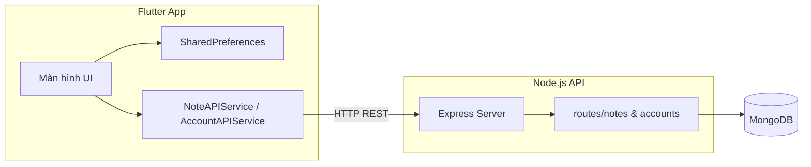

# Note App — Ứng dụng ghi chú cá nhân

Ứng dụng quản lý ghi chú đa nền tảng, xây dựng theo mô hình **client–server**: giao diện **Flutter** kết nối API **Node.js (Express)** và lưu trữ dữ liệu trên **MongoDB**. Mỗi người dùng có tài khoản riêng; ghi chú được gắn với tài khoản và chỉ hiển thị sau khi đăng nhập.

---

## Mô tả dự án

Note App giúp người dùng tạo, xem, chỉnh sửa và xóa ghi chú trên điện thoại hoặc máy tính. Ứng dụng hỗ trợ phân loại theo **độ ưu tiên**, **nhãn (tags)** và **màu sắc**, kèm các công cụ tìm kiếm, lọc và sắp xếp để quản lý danh sách ghi chú hiệu quả.

Dự án phù hợp làm bài tập / đồ án môn lập trình di động hoặc full-stack, thể hiện luồng xác thực người dùng, gọi REST API và đồng bộ dữ liệu với cơ sở dữ liệu NoSQL.

---

## Tính năng chính

### Xác thực & tài khoản
- **Đăng ký** tài khoản mới (username, mật khẩu)
- **Đăng nhập** / **đăng xuất** với xác nhận trước khi thoát
- Lưu trạng thái đăng nhập bằng **SharedPreferences** (tự vào màn hình ghi chú khi đã đăng nhập)
- Ghi chú gắn với `idAccount` — mỗi user chỉ thao tác dữ liệu của mình

### Quản lý ghi chú (CRUD)
- **Thêm** ghi chú mới (tiêu đề, nội dung, ưu tiên, màu, tags)
- **Xem chi tiết** ghi chú (tiêu đề, nội dung, ưu tiên, ngày tạo/sửa, tags, màu)
- **Sửa** và **xóa** ghi chú (có hộp thoại xác nhận khi xóa)
- Đồng bộ dữ liệu qua REST API với MongoDB

### Tổ chức & tìm kiếm
- **3 mức ưu tiên** (cao / trung bình / thấp) — màu nền thẻ ghi chú theo mức ưu tiên
- **Tags (nhãn)** — thêm/xóa chip nhãn khi tạo hoặc sửa ghi chú
- **Chọn màu** ghi chú bằng color picker (`flutter_colorpicker`)
- **Tìm kiếm** theo tiêu đề và nội dung (`SearchDelegate`)
- **Lọc** theo mức ưu tiên
- **Sắp xếp** theo ngày tạo hoặc theo ưu tiên
- Chuyển đổi **danh sách** ↔ **lưới** (grid 2 cột)
- **Làm mới** danh sách từ server

---

## Điểm nổi bật

| Điểm mạnh | Chi tiết |
|-----------|----------|
| **Full-stack thực tế** | Flutter (UI) + Express (API) + MongoDB (lưu trữ) |
| **Đa nền tảng** | Android, iOS, Web, Windows, Linux, macOS (Flutter) |
| **Phân tách rõ ràng** | `model` / `api` / `view` trên client; `routes` / `models` trên server |
| **REST API chuẩn** | CRUD cho `notes` và `accounts`, CORS bật sẵn |
| **Trải nghiệm người dùng** | Loading, SnackBar thông báo, validate form, ẩn/hiện mật khẩu |
| **Quản lý ghi chú linh hoạt** | Tìm kiếm, lọc, sắp xếp, 2 chế độ hiển thị trong một màn hình |

---

## Công nghệ sử dụng

### Frontend (Flutter)
- **Dart** SDK `^3.7.0`
- **http** — gọi REST API
- **shared_preferences** — lưu phiên đăng nhập
- **intl** — định dạng ngày giờ
- **flutter_colorpicker** — chọn màu ghi chú
- **Material Design**

### Backend (Node.js)
- **Express** 5.x
- **Mongoose** — ODM cho MongoDB
- **cors**, **dotenv**

### Cơ sở dữ liệu
- **MongoDB**

---

## Kiến trúc hệ thống



---

## Cấu trúc thư mục

```
NoteApp/
├── README.md
└── Note_App/
    ├── lib/
    │   ├── main.dart                 # Khởi động app, kiểm tra đăng nhập
    │   ├── api/
    │   │   ├── AccountAPIService.dart
    │   │   └── NoteAPIService.dart
    │   ├── model/
    │   │   ├── Account.dart
    │   │   └── Note.dart
    │   └── view/
    │       ├── LoginScreen.dart
    │       ├── RegisterScreen.dart
    │       ├── NoteListScreen.dart
    │       ├── NoteListItem.dart
    │       ├── NoteForm.dart
    │       ├── AddNoteScreen.dart
    │       ├── EditNoteScreen.dart
    │       └── NoteDetailScreen.dart
    ├── note_api/
    │   ├── server.js
    │   ├── models/
    │   │   ├── Account.js
    │   │   └── Note.js
    │   └── routes/
    │       ├── accountRoutes.js
    │       └── noteRoutes.js
    ├── assets/images/
    └── pubspec.yaml
```

---

## API Endpoints

### Tài khoản (`/api/accounts`)

| Method | Endpoint | Mô tả |
|--------|----------|--------|
| `GET` | `/` | Lấy danh sách tài khoản |
| `POST` | `/` | Đăng ký tài khoản mới |
| `POST` | `/login` | Đăng nhập |
| `PUT` | `/:id` | Cập nhật tài khoản |
| `DELETE` | `/:id` | Xóa tài khoản |

### Ghi chú (`/api/notes`)

| Method | Endpoint | Mô tả |
|--------|----------|--------|
| `GET` | `/:idAccount` | Lấy tất cả ghi chú của một tài khoản |
| `POST` | `/` | Tạo ghi chú mới |
| `PUT` | `/:id` | Cập nhật ghi chú |
| `DELETE` | `/:id` | Xóa ghi chú |

---

## Yêu cầu hệ thống

- [Flutter SDK](https://docs.flutter.dev/get-started/install) (Dart 3.7+)
- [Node.js](https://nodejs.org/) (khuyến nghị LTS)
- [MongoDB](https://www.mongodb.com/) (local hoặc MongoDB Atlas)

---

## Hướng dẫn cài đặt & chạy

### 1. Clone repository

```bash
git clone https://github.com/<username>/NoteApp.git
cd NoteApp/Note_App
```

### 2. Cấu hình & chạy Backend

```bash
cd note_api
npm install
```

Tạo file `.env` trong thư mục `note_api`:

```env
MONGODB_URI=mongodb://localhost:27017/noteapp
PORT=3000
```

Chạy server:

```bash
node server.js
```

Khi thành công, terminal hiển thị: `Server đang chạy trên cổng 3000` và `Đã kết nối với MongoDB`.

### 3. Cấu hình URL API trên Flutter

Trong `lib/api/NoteAPIService.dart` và `lib/api/AccountAPIService.dart`, `baseUrl` mặc định trỏ tới:

```dart
http://10.0.2.2:3000/api/...
```

| Môi trường | URL gợi ý |
|------------|-----------|
| Android Emulator | `http://10.0.2.2:3000` |
| iOS Simulator | `http://localhost:3000` |
| Thiết bị thật | `http://<IP-máy-tính>:3000` |

Đổi `baseUrl` cho khớp môi trường bạn đang chạy.

### 4. Chạy ứng dụng Flutter

```bash
cd ..   # về thư mục Note_App
flutter pub get
flutter run
```

---

## Màn hình ứng dụng

| Màn hình | Chức năng |
|----------|-----------|
| Đăng nhập | Nhập username/password, chuyển sang đăng ký |
| Đăng ký | Tạo tài khoản mới |
| Danh sách ghi chú | Hiển thị, tìm kiếm, lọc, sắp xếp, thêm/sửa/xóa |
| Form ghi chú | Thêm hoặc cập nhật (tiêu đề, nội dung, ưu tiên, màu, tags) |
| Chi tiết ghi chú | Xem đầy đủ thông tin, nút sửa nhanh |

---

## Mô hình dữ liệu

### Note (Ghi chú)
- `title`, `content` — tiêu đề và nội dung
- `priority` — 1 (cao), 2 (trung bình), 3 (thấp)
- `tags` — mảng chuỗi nhãn
- `color` — mã màu (ARGB)
- `createAt`, `modifiedAt` — thời gian tạo / cập nhật
- `idAccount` — ID tài khoản sở hữu

### Account (Tài khoản)
- `userId`, `username`, `password`
- `status`, `lastLogin`, `createdAt`

---


## Tác giả

1uccc
